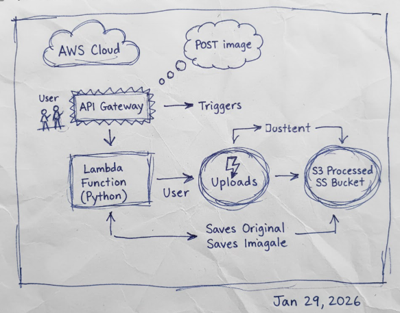

# Serverless Image Processing Pipeline

An enterprise-grade, event-driven image processing architecture built on AWS using Terraform (Infrastructure as Code). This project automates the workflow of receiving, processing, and storing media files securely in the cloud.

## 📺 Project Demonstration
**[View Demo on YouTube](https://youtu.be/297VkFFXqLc)**

---

## 🏗️ System Architecture & Workflow



### Workflow Steps:
1. **API Entry**: User sends an image via a POST request to the **AWS API Gateway**.
2. **Security**: Request is validated using a unique **X-API-Key** in the header.
3. **Compute**: API Gateway triggers an **AWS Lambda** function, passing the image data.
4. **Storage (Raw)**: The Lambda function saves the original image to the **Uploads S3 Bucket**.
5. **Processing**: The function performs image processing and saves the result to the **Processed S3 Bucket**.
6. **Separation**: Using two distinct buckets prevents recursive triggers and maintains a clean data lifecycle.

---

## 📂 Repository Structure
```text
.
├── api-spec/
│   └── openapi.yaml          # API documentation & endpoints
├── functions/
│   └── image_processor.py    # Python logic for image handling
├── terraform/
│   ├── main.tf               # Infrastructure resource definitions
│   └── variables.tf          # Environment variables
├── work_flow.png             # System Architecture Diagram
├── README.md                 # Project documentation
└── submission.json           # API credentials and endpoint

🛠️ Technology Stack

Cloud Platform: AWS

Infrastructure as Code (IaC): Terraform

Compute: AWS Lambda

Storage: Amazon S3

API Management: AWS API Gateway

Language: Python 3.x

🚀 Deployment Guide
Step 1: Initialization
terraform init

Step 2: Infrastructure Provisioning
terraform apply -auto-approve

Step 3: Verification

After deployment, retrieve the API Endpoint and API Key from Terraform output or submission.json.

🧪 Testing the Pipeline

Test the API by uploading an image using curl:

curl -X POST <YOUR_API_ENDPOINT> \
  -H "x-api-key: <YOUR_API_KEY>" \
  -H "Content-Type: image/jpeg" \
  --data-binary "@test_image.jpg"

Expected Results

HTTP 200 OK response

Original image stored in Uploads S3 Bucket

Processed image stored in Processed S3 Bucket

🧹 Resource Cleanup

To avoid ongoing AWS charges, destroy the infrastructure:

terraform destroy -auto-approve

